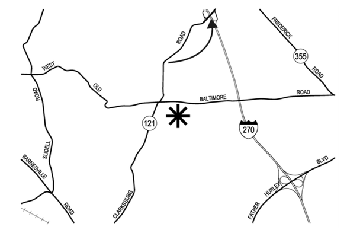

# Intimidation by Ecolocation
OSINT, 300 points

## Description:
You objective for this challenge will be in three parts.

Part 1 - Find the user. Do not contact anyone regarding this challenge, as there may be legitimate users with this moniker (unlikely though that may be.) The account used in the challenge is not monitored, so you'll get no help anyway. The username is 0tYGJH2E

Part 2 - Find the location of the flag. You'll need to find the right URL.

Part 3 - Find the password to access the flag by finding the location indicated in the image. There is a sign at the place indicated by the arrow, and those words are the password (no spaces or special characters.) For example, if the sign reads, "Employee Parking Only" then your password is "EmployeeParkingOnly"

## Solution


### Part 1: Find the user 

To solve part one, we need to locate accounts associated with the username ``0tYGJH2E``. We can use a tool like [Sherlock](https://sherlockproject.xyz/) to search for the account across numerous different platforms.

```shell
python3 -m sherlock_project 0tYGJH2E

[*] Checking username 0tYGJH2E on:

[+] ProductHunt: https://www.producthunt.com/@0tYGJH2E
[+] PyPi: https://pypi.org/user/0tYGJH2E
[+] Shpock: https://www.shpock.com/shop/0tYGJH2E/items
[+] SlideShare: https://slideshare.net/0tYGJH2E
[+] Strava: https://www.strava.com/athletes/0tYGJH2E
[+] TLDR Legal: https://tldrlegal.com/users/0tYGJH2E/
[+] Twitch: https://www.twitch.tv/0tYGJH2E
[+] babyRU: https://www.baby.ru/u/0tYGJH2E/
[+] mastodon.social: https://mastodon.social/@0tYGJH2E

[*] Search completed with 9 results
```

Most of these links are inactive but the [Mastodon account](https://mastodon.social/@0tYGJH2E) is promising.  There are two posts associated with this mastodon account.

### Part 2: Flag Location 

The [first post](https://mastodon.social/@0tYGJH2E/113681703097439377) on the Mastodon account is a 32 second video of someone typing on Hacker Typer. In the background of the video, there is a visible [Pastebin URL.](https://pastebin.com/0tYGJH2E) Visiting the link reveals a password protected paste. 


### Part 3: Find the password

The [second post](https://mastodon.social/@0tYGJH2E/113681703783316548) on the Mastodon account is a image of a map: 



According to the challenge description, *"There is a sign at the place indicated by the arrow, and those words are the password (no spaces or special characters.)"*

After using Google Image Search, this [planning amendment document](https://montgomeryplanningboard.org/wp-content/uploads/2021/09/Linthicum-West-staff-report-12005003A_FINAL.pdf) appeared. The challenge map matches the map inside the document! Based on the information in the document the address for the star is *14222 West Old Baltimore Road*.

Starting at the star and following the map to the arrow leads us [here](https://www.google.com/maps/@39.231187,-77.2847722,3a,15.2y,359.86h,91.65t/data=!3m8!1e1!3m6!1syfsA60WZxKy7GF6DFLE0ZQ!2e0!5s20241101T000000!6shttps:%2F%2Fstreetviewpixels-pa.googleapis.com%2Fv1%2Fthumbnail%3Fcb_client%3Dmaps_sv.tactile%26w%3D900%26h%3D600%26pitch%3D-1.6476942334859501%26panoid%3DyfsA60WZxKy7GF6DFLE0ZQ%26yaw%3D359.8575450365323!7i16384!8i8192?entry=ttu&g_ep=EgoyMDI1MDEwOC4wIKXMDSoASAFQAw%3D%3D)

On Google Street View, there is a road sign titled *"HOV LANE ENDS"* at the location indicated by the arrow.

The flag: ``poctf{uwsp_1_4m_7h3_0n3_wh0_kn0ck5}``