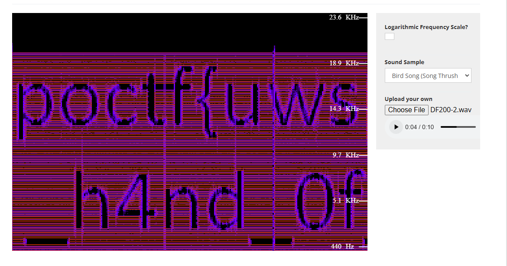

# Known Unknowns 
Forensics, 200 points

## Description:
So, I was laying in an open field with my super sensitive directional mic, trying to listen to stars like I do every Saturday night. You know, normal stuff. It was going fine and I was jamming out to the sounds of Saturn when I hear this sound coming through. I'm guessing it's the sound of swamp gas reflecting off Jupiter.

## Solution:
The challenge provides us with a wav file that plays sounds on different frequencies. We can use an online [audio spectrum analyzer](https://academo.org/demos/spectrum-analyzer/) to see if anything is hidden in the wav file.

The flag ``poctf{uwsp_7h3_13f7_h4nd_0f_d4rkn355}``