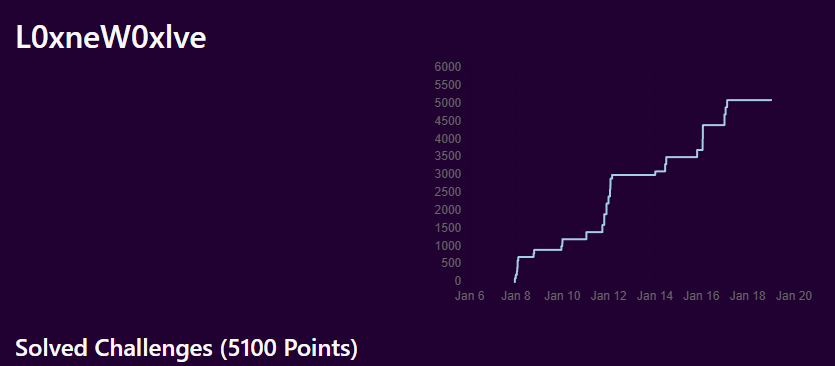

# Pointer Overflow CTF

The University of Wisconsin - Stevens Point and the Department of Computing and New Media Technologies happily welcomes you to the Pointer Overflow CTF. This contest is a challenge of ingenuity and skill brought to you in honor of our incredible students and alumni.

Feel free to register and participate! The contest is free, open to one and all, and runs in the Fall semesters. This year's contest is the second annual, and will run from September 15th, 2024 to January 19th, 2025. There are 90 challenges this year, with 5 being released each week of the contest.

[CTFtime link](https://ctftime.org/event/2121) 

## Stats

The competition ran from September 15th, 2024 to January 19th, 2025. I started participating by myself on January 7th under the team name L0xneW0xlve. I placed 63 / 2503 with a total of 5100 points out of a possible 19800. 

## Writeups by Category

### Crack 
*  [No Thing Lasts Forever](https://github.com/Jdwalli/ctf-writeups/blob/main/2024_Pointer_Overflow/No%20Thing%20Lasts%20Forever.md)

### Crypto
*  [Everyone's Friend](https://github.com/Jdwalli/ctf-writeups/blob/main/2024_Pointer_Overflow/Everyone's%20Friend.md)
*  [Knuckle Buster](https://github.com/Jdwalli/ctf-writeups/blob/main/2024_Pointer_Overflow/Knuckle%20Buster.md)
*  [Put Down Thy Wrath](https://github.com/Jdwalli/ctf-writeups/blob/main/2024_Pointer_Overflow/Put%20Down%20Thy%20Wrath.md)

### Forensics 
*  [I've Been There Too](https://github.com/Jdwalli/ctf-writeups/blob/main/2024_Pointer_Overflow/I've%20Been%20There%20Too.md)
*  [Known Unknowns](https://github.com/Jdwalli/ctf-writeups/blob/main/2024_Pointer_Overflow/Known%20Unknowns.md)
*  [Never Met the Pieman](https://github.com/Jdwalli/ctf-writeups/blob/main/2024_Pointer_Overflow/Never%20Met%20the%20Pieman.md)

### Misc 
*  [A Coward Dies Twice](https://github.com/Jdwalli/ctf-writeups/blob/main/2024_Pointer_Overflow/A%20Coward%20Dies%20Twice.md)
*  [Embrace The Suck](https://github.com/Jdwalli/ctf-writeups/blob/main/2024_Pointer_Overflow/Embrace%20The%20Suck.md)
*  [My Name is Human](https://github.com/Jdwalli/ctf-writeups/blob/main/2024_Pointer_Overflow/My%20Name%20is%20Human.md)

### OSINT
*  [Who Can It Be Now](https://github.com/Jdwalli/ctf-writeups/blob/main/2024_Pointer_Overflow/Who%20Can%20It%20Be%20Now.md)
*  [Something to Say About It](https://github.com/Jdwalli/ctf-writeups/blob/main/2024_Pointer_Overflow/Something%20to%20Say%20About%20It.md)
*  [A Tangle A Jingle](https://github.com/Jdwalli/ctf-writeups/blob/main/2024_Pointer_Overflow/A%20Tangle%20A%20Jingle.md)
*  [Down Like This](https://github.com/Jdwalli/ctf-writeups/blob/main/2024_Pointer_Overflow/Down%20Like%20This.md)
*  [Intimidation by Echolocation](https://github.com/Jdwalli/ctf-writeups/blob/main/2024_Pointer_Overflow/Intimidation%20by%20Ecolocation.md)

### Reversing 
 *  [Well Said but Poorly Heard](https://github.com/Jdwalli/ctf-writeups/blob/main/2024_Pointer_Overflow/Well%20Said%20but%20Poorly%20Heard.md)
 *  [End of the Line](https://github.com/Jdwalli/ctf-writeups/blob/main/2024_Pointer_Overflow/End%20of%20the%20Line.md)
 *  [Understanding Nonsense](https://github.com/Jdwalli/ctf-writeups/blob/main/2024_Pointer_Overflow/Understanding%20Nonsense.md)

### Stego 
*  [Things Said and Unsaid](https://github.com/Jdwalli/ctf-writeups/blob/main/2024_Pointer_Overflow/Things%20Said%20and%20Unsaid.md)
*  [Things Seen and Unseen](https://github.com/Jdwalli/ctf-writeups/blob/main/2024_Pointer_Overflow/Things%20Seen%20and%20Unseen.md)
*  [Reading Between the Lines](https://github.com/Jdwalli/ctf-writeups/blob/main/2024_Pointer_Overflow/Reading%20Between%20the%20Lines.md)

### Web 
*  [The Way Out is Through](https://github.com/Jdwalli/ctf-writeups/blob/main/2024_Pointer_Overflow/The%20Way%20Out%20is%20Through.md)
*  [I Have Objections](https://github.com/Jdwalli/ctf-writeups/blob/main/2024_Pointer_Overflow/I%20Have%20Objections.md)
*  [Giving Up the Game](https://github.com/Jdwalli/ctf-writeups/blob/main/2024_Pointer_Overflow/Giving%20Up%20the%20Game.md)
*  [Three Raccoons in a Trench Coat](https://github.com/Jdwalli/ctf-writeups/blob/main/2024_Pointer_Overflow/Three%20Raccoons%20in%20a%20Trench%20Coat.md)
*  [Gifting a White Elephant](https://github.com/Jdwalli/ctf-writeups/blob/main/2024_Pointer_Overflow/Gifting%20a%20White%20Elephant.md)
*  [On My Own Terms](https://github.com/Jdwalli/ctf-writeups/blob/main/2024_Pointer_Overflow/On%20My%20Own%20Terms.md)
*  [The Color Drained from His Face](https://github.com/Jdwalli/ctf-writeups/blob/main/2024_Pointer_Overflow/The%20Color%20Drained%20from%20His%20Face.md)
*  [A Bitter Delicacy](https://github.com/Jdwalli/ctf-writeups/blob/main/2024_Pointer_Overflow/A%20Bitter%20Delicacy.md)
