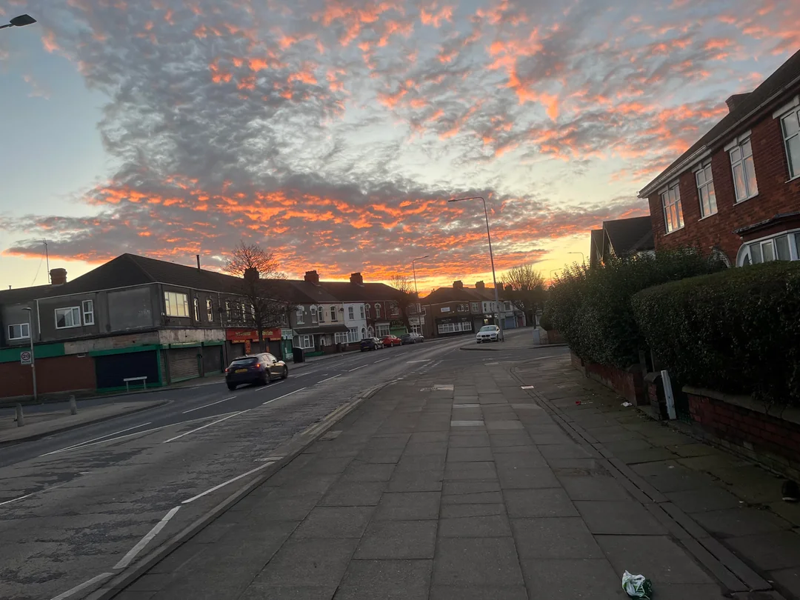

# Something to Say About It
OSINT, 200 points

## Description:
Sometimes I like to try to find the exact location where a photo was taken. A little OSINT exercise I do sometimes to keep my skills sharp. This image was posted to a social media platform last year. I was able to find where it was taken, and if you can too then you will see that there is a business just out of frame, across the street from the building on the corner, to the left of the bollards. The phone number on their sign is the password to the archive (no spaces or special characters.)

## Solution

When initially analyzing the photo, several details stand out. There is a speed limit sign and a car license plate indicating the location is in Europe. Additionally, several stores in the area have noticeable features like names.

Since the description mentioned that the image was found on social media, I searched for the original post. TinEye yielded no results but using Google Reverse Image Search led me to the [original reddit thread](https://www.reddit.com/r/pics/comments/1avt0nk/some_sky_pictures_from_my_paper_round/) where the image was likely first posted. 

Viewing the Reddit image on my phone allowed me to zoom in and examine details more closely. The building at the end of the street appears to have the words "Salon @ 245," which could indicate that "245" is related to the street name or number. The red building nearby has the word "Centre" on it, which might refer to a "Furniture Centre" or something similar. 

After a few dead ends, I revisited Google Image Search and focused on specific portions of the buildings in the photo a promising [match.](https://www.grimsbytelegraph.co.uk/news/grimsby-news/man-launched-unprovoked-knife-attack-8755369). After reading the article, I was able to see that the image was likely taken on [Grimsby Road in Cleethorpes, UK](https://www.google.com/maps/@53.5677051,-0.0441088,3a,75y,68h,90t/data=!3m7!1e1!3m5!1sHezVPd16qUTJtCJqAUubEA!2e0!6shttps:%2F%2Fstreetviewpixels-pa.googleapis.com%2Fv1%2Fthumbnail%3Fcb_client%3Dmaps_sv.tactile%26w%3D900%26h%3D600%26pitch%3D0%26panoid%3DHezVPd16qUTJtCJqAUubEA%26yaw%3D67.99529419642565!7i16384!8i8192?hl=en&entry=ttu&g_ep=EgoyMDI1MDEwOC4wIKXMDSoASAFQAw%3D%3D). 

After looking to the left of the bollards, I was able to see the phone number to open the zip archive. 

The flag: ``poctf{uwsp_1_h4v3_4_dr34m}``

