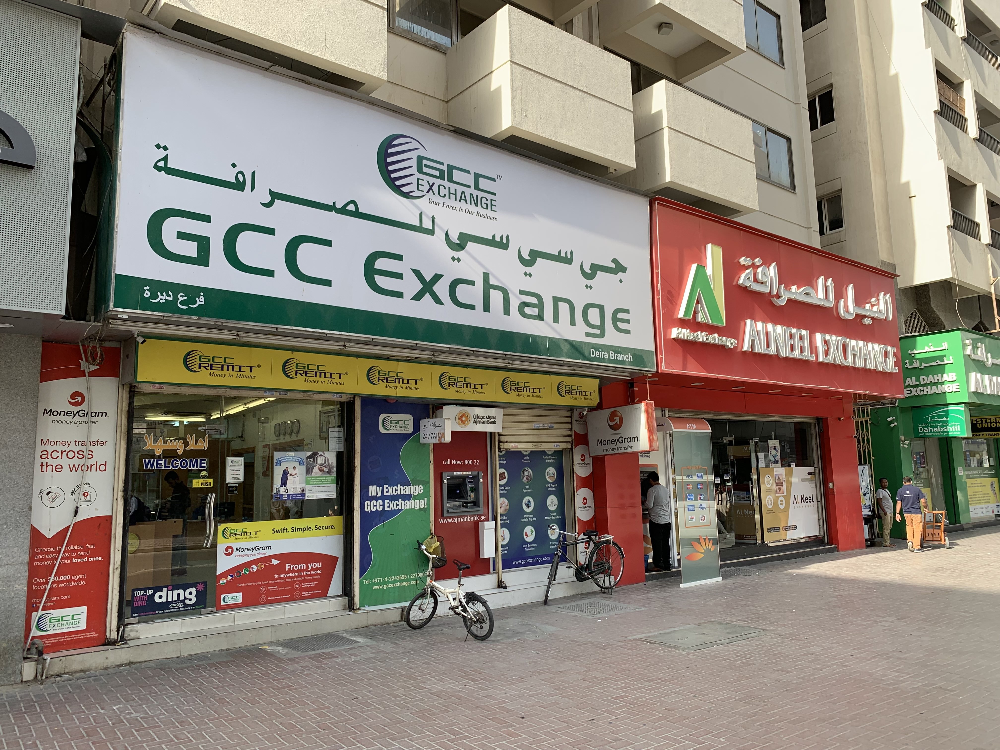

# Down Like This
OSINT, 300 points

You ever look around at the things you see every day, and think about how what is mundane for you would be novel and interesting for others? Take the following image, for example.

A perfectly normal street in a perfectly mundane place for many people, but when I look at it, I see all these little details that cause it to differ from my own version of mundane. The script, the bikes left unsecured near what looks to be an ATM in broad view of the sidewalk (unlike the one next to it with a privacy screen), the format of the telephone numbers, and on and on... It looks exactly like scenes I have viewed many times, and in fact it is a place much like those places I've been. But it's those subtle differences - exotic spices on a familiar food.

The really incredible thing about living in our time is that we don't have to travel to see these things. We can go to a map and drop the little dude on the blue line and take a look around at (most) places in the world. But that's not it - we can not just see a place, but we can sometimes go back in time. See it how it was years ago.

If we went to this place, for example, we might see the comings and goings of people throughout time. Let's pay a little more attention to that. At one point, there was a white van parked on the street in front of this location. The license plate is obviously blurred, but the fax number on the back is not. That is your target. The archive below contains the flag. The password for this archive is the fax number on the back of the van parked in front of this location. Do not include spaces or special characters - just the numbers and all of the numbers you see there.

## Solution

The *GCC Exchange* building in the image is a big location help. When we zoom in on the building, we can see text that says *Deira Branch* which can aid in our location search. We can use the company's [branch locator](https://www.gccexchange.com/our-branches) to find the address of this specific branch. 

After finding the address, we can go to the location and cycle through Google Maps until we find the [correct year](https://www.google.com/maps/@25.2684502,55.3036891,3a,78.3y,357.94h,81.03t/data=!3m8!1e1!3m6!1s4zbHlJ_L1dSeobJkLG5LNg!2e0!5s20161201T000000!6shttps:%2F%2Fstreetviewpixels-pa.googleapis.com%2Fv1%2Fthumbnail%3Fcb_client%3Dmaps_sv.tactile%26w%3D900%26h%3D600%26pitch%3D8.971505892620527%26panoid%3D4zbHlJ_L1dSeobJkLG5LNg%26yaw%3D357.9360871598383!7i13312!8i6656?entry=ttu&g_ep=EgoyMDI1MDEwOC4wIKXMDSoASAFQAw%3D%3D) and then zoom in on the van. 

The flag: ``poctf{uwsp_7h3_4n5w3r_70_3v3ry7h1n6}``