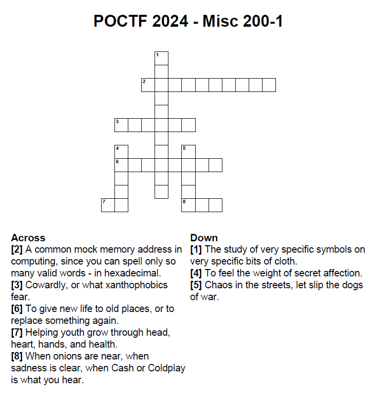

# My Name is Human
Misc, 200 points

## Description:

poctf{uwsp_[8][6][3]_[5][7][1][2][4]}

## Solution:
We have to solve the crossword and use the mapping ``poctf{uwsp_[8][6][3]_[5][7][1][2][4]}`` to figure out the flag.

| **Across**    | **Down**     |
|---------------|--------------|
| [2] = 0xDEADBEFF | [1] = Vexillology |
| [3] = Yellow   | [4] = Crush   |
| [6] = Renovate | [5] = Havoc   |
| [7] = 4H       |              |
| [8] = Cry      |              |

We can then use the first letter of every number for the flag.

The flag ``poctf{uwsp_cry_h4v0c}``