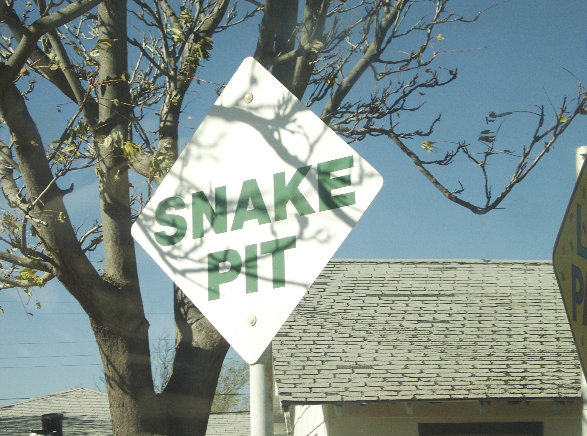
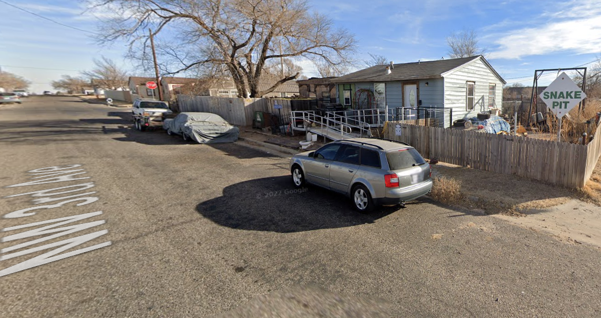

# Something to Say About It
OSINT, 200 points

## Description:
I have a dynamite idea! Let's go on a little snake hunt. Now, where do you find snakes? That's right, in snake pits! How do you find snake pits? By following the clearly marked signs to the designated snake dumping pit locations, of course! Surely you've seen those around your city, right? They probably look a little like this one:



I'll even give you a little help by zooming out a little. You're not xanthophobic, are you?



You know, while we're here, I'm going to grab a fresh password for the archive that contains the flag. As a memento to remember our hunting expedition. The phone number on the sign back there should do. Numbers only, no parenthesis, no spaces, no dashes.


## Solution

When we initially analyze the photos we can see information that stands out. For example, in the second image we can see the text *NW 3rd Ave* which indicates a street for us to look for. 

We can also use our tools to see if any data has been left behind. We can run the ``file *`` command on these images and and see if there is anything special about them.

```shell
OSINT200-1_first.jpg:  JPEG image data, Exif standard: [TIFF image data, big-endian, direntries=14, description=Hint: There are no snakes in Ireland, so the sign isn't there.Ligma, manufacturer=Ligma], comment: "AppleMark", baseline, precision 8, 2296x1704, components 3
OSINT200-1_second.png: PNG image data, 1041 x 551, 8-bit/color RGBA, non-interlaced
OSINT200-1_third.png:  PNG image data, 1153 x 562, 8-bit/color RGBA, non-interlaced
```

The first image, ``OSINT200-1_first.jpg`` contains Exif data that we can analyze using ``exiftool``

```shell
======== OSINT200-1_first.jpg
......
Image Description               : Hint: There are no snakes in Ireland, so the sign isn't there.
ser Comment                    : Hint: The sign is written in English, but is not in England. Isn't that weird?
Artist                          : Gergory Horse, MD
GPS Latitude                    : 43 deg 46' 10.55" N
GPS Longitude                   : 88 deg 26' 29.40" W
Focal Length                    : 662.0 mm
GPS Position                    : 43 deg 46' 10.55" N, 88 deg 26' 29.40" W
```

We get several hints: 
1. The location is not in Ireland.
2. The sign is in an English-speaking country with snakes, such as the United States or Australia.

When looking back at the description, we get a clue. *"I'll even give you a little help by zooming out a little. You're not xanthophobic, are you?"* Since *xanthophobic* is defined as an irrational fear of yellow, we can assume that the color yellow has something to do with the location.

I started my search in the United States looking for states that have snakes and streets named *NW 3rd Ave*. Texas has a city named Amarillo (which means "yellow" in Spanish) and I found the target [there.](https://www.google.com/maps/@35.2194908,-101.8798667,3a,15.8y,311.65h,73.5t/data=!3m7!1e1!3m5!1s_uPWMy9hATDU0mH_ZrxTSA!2e0!6shttps:%2F%2Fstreetviewpixels-pa.googleapis.com%2Fv1%2Fthumbnail%3Fcb_client%3Dmaps_sv.tactile%26w%3D900%26h%3D600%26pitch%3D16.50260264845106%26panoid%3D_uPWMy9hATDU0mH_ZrxTSA%26yaw%3D311.6518048836398!7i16384!8i8192?entry=ttu&g_ep=EgoyMDI1MDEwOC4wIKXMDSoASAFQAw%3D%3D). 


The flag: ``poctf{uwsp_f07r7un3_f4v0r5_7h3_b01d}``