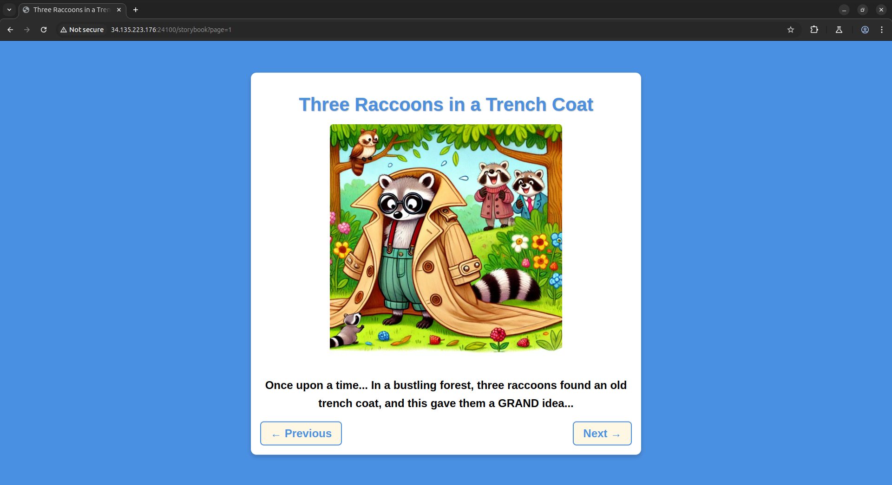
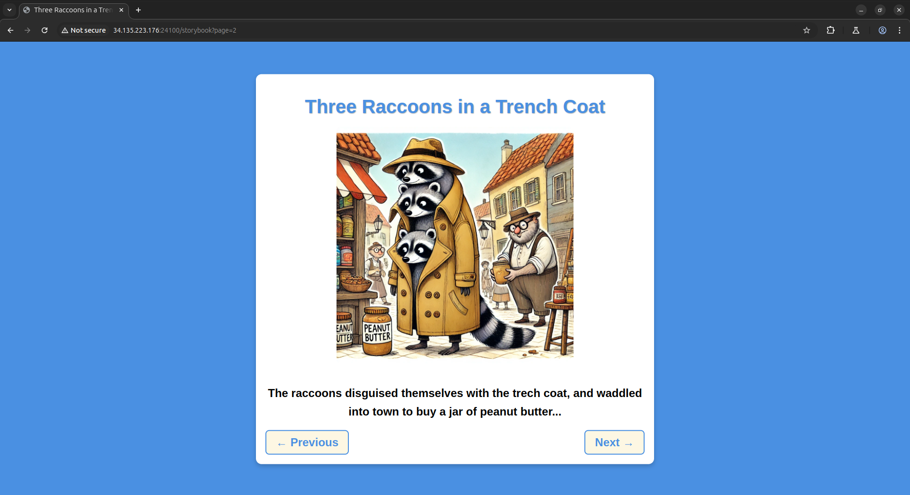
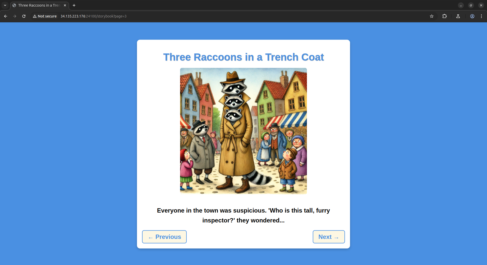
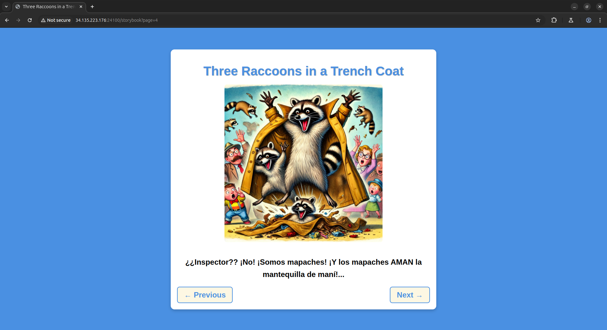
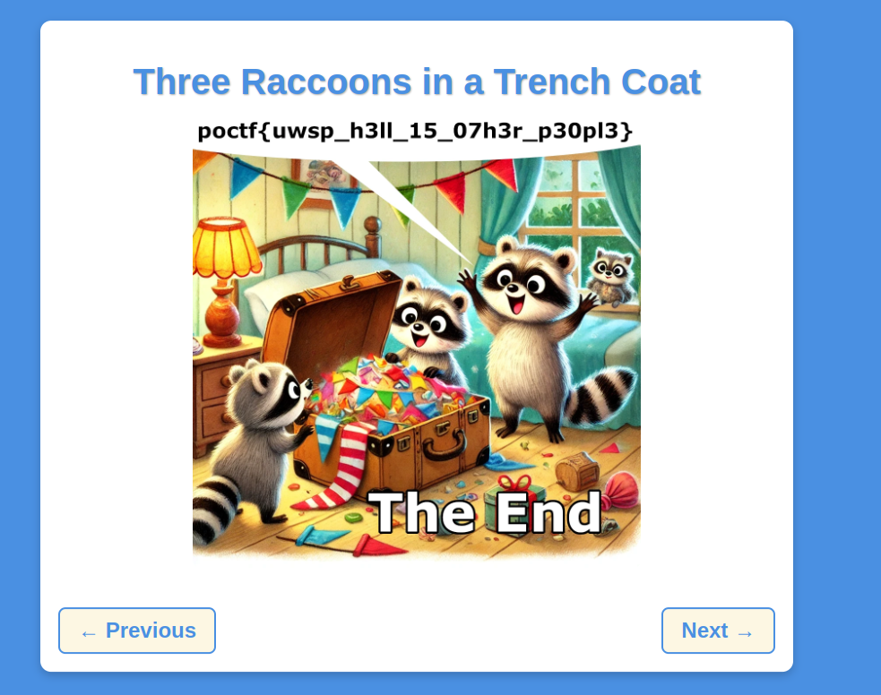

# Three Raccoons in a Trench Coat
Web, 200 points

## Description: 
When designing the contest, I sometimes like to use themes. The theme for the Web challenges, you may have realized by now, is that the websites are never exactly what the challenge text tells you they will be. I go on about how the site will be one thing, then you click and it's some humorous alternative.

Well, not this time. This time, I'm going to give you a challenge that is exactly what the challenge text says it will be.

It is probably not significant that I have chosen just this one challenge to be completely honest.

Do make sure you are familiar with the [hints](https://pointeroverflowctf.com/Hints) for Web challenges before you begin work on this one. I'd hate to see someone forced to sit out of the Web challenges for the remainder of the contest. Especially when the contest is designed to release all the high value challenges after this one. Not sure why I'd do that, but it's probably best to make like three raccoons in a trench coat, try to blend in and not draw too much attention to yourself.

## Solution

Visiting the website url, ```http://34.135.223.176:24100/storybook?page=1``` reveals a potentially exploitable URL parameter, ``page``.

When we interact with the story on the website, we can see the page url parameter increment when we press the next button.

 -> 
 -> 



When we click the next button on page three, it just navigates to the same page. However, manually setting `page=4` reveals a new page. 



Manually setting `page=5`, results in a 404 error and text that reads ``The raccoons don't recognize this path!``

We can use a tool called [ffuz](https://github.com/ffuf/ffuf) to test the url parameter and find hidden pages:

```shell
ffuf -u "http://34.135.223.176:24100/storybook?page=FUZZ" -w /usr/share/dirbuster/wordlists/directory-list-2.3-small.txt -o results.json -mc 200 -rate 3
```

*   **Target URL:** `http://34.135.223.176:24100/storybook?page=FUZZ` (FUZZ is a placeholder for the different values ffuf will try from the wordlist)
*   **Wordlist:** `/usr/share/dirbuster/wordlists/directory-list-2.3-small.txt`
*   **Output File:** `results.json`
*   **Match Rule:** We only want to see 200 responses with `-mc 200`
*   **Request Rate Limit:** We're limiting requests to 3 per second with `-rate 3` to avoid error codes **Note**: You'll get a 429 Too Many Requests error from this website if you do more than 200 requests per minute


```shell

        /'___\  /'___\           /'___\
       /\ \__/ /\ \__/  __  __  /\ \__/
       \ \ ,__\\ \ ,__\/\ \/\ \ \ \ ,__\
        \ \ \_/ \ \ \_/\ \ \_\ \ \ \ \_/
         \ \_\   \ \_\  \ \____/  \ \_\
          \/_/    \/_/   \/___/    \/_/

       v2.1.0-dev
________________________________________________

 :: Method           : GET
 :: URL              : http://34.135.223.176:24100/storybook?page=FUZZ
 :: Wordlist         : FUZZ: /usr/share/dirbuster/wordlists/directory-list-2.3-small.txt
 :: Output file      : results.json
 :: File format      : json
 :: Follow redirects : false
 :: Calibration      : false
 :: Timeout          : 10
 :: Threads          : 40
 :: Matcher          : Response status: 200
________________________________________________

1                       [Status: 200, Size: 3144, Words: 1592, Lines: 87, Duration: 35ms]
2                       [Status: 200, Size: 3136, Words: 1589, Lines: 87, Duration: 42ms]
archive                 [Status: 200, Size: 3036, Words: 1571, Lines: 87, Duration: 35ms]
3                       [Status: 200, Size: 3117, Words: 1584, Lines: 87, Duration: 87ms]
4                       [Status: 200, Size: 3116, Words: 1582, Lines: 87, Duration: 36ms]
14                      [Status: 200, Size: 3215, Words: 1600, Lines: 87, Duration: 35ms]
:: Progress: [104/87664] :: Job [1/1] :: 3 req/sec :: Duration: [0:00:34] :: Errors: 0 ::
```


While the fuzzer was running, I tried every new page that returned a 200 status code. When I navigated to the archive link, I found the flag inside a photo with the raccoons. 





The flag: ``poctf{uwsp_h3ll_15_07h3r_p30pl3}``